# Задание 1

## C4 Диаграммы

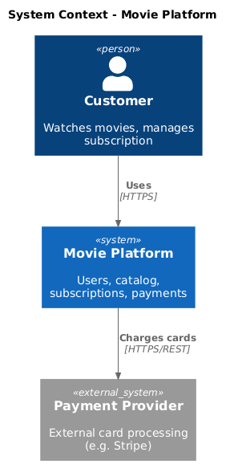
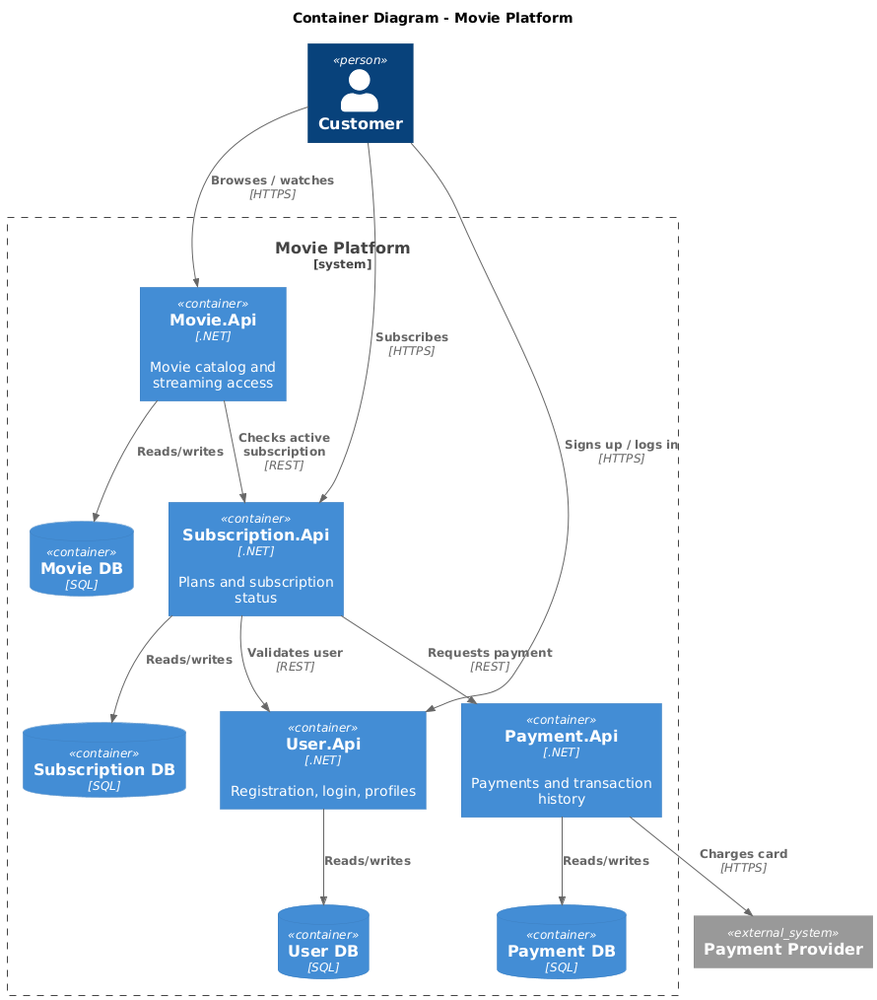

## ER диаграмма
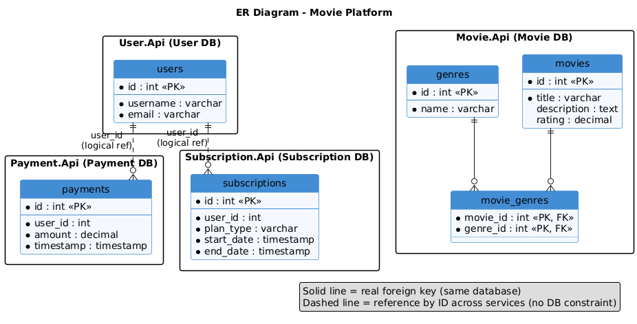

# Задание 2

### 1. Proxy

- Реализован сервис на .NET8 C# (./src/microservices/proxy)
- Сервис прокси принимает запросы на /api/movies и перенаправляет их в монолит или в сервис movies, в зависимости от значения переменной окружения GRADUAL_MIGRATION и MOVIES_MIGRATION_PERCENT.
- Сервис запускается на порту 8000 и имеет health-check на /health

- Протестирован постепенный переход, меняя переменную окружения MOVIES_MIGRATION_PERCENT в файле docker-compose.yml.

### 2. Kafka

- Разработан сервис на .NET8 C# (./src/microservices/events), при вызове которого создаются события User/Payment/Movie и обрабатываются внутри сервиса с записью в лог.
- Сервис запускается на порту 8082 и имеет health-check на /health
- Сервис добавлен в docker-compose

#### Postman Тесты

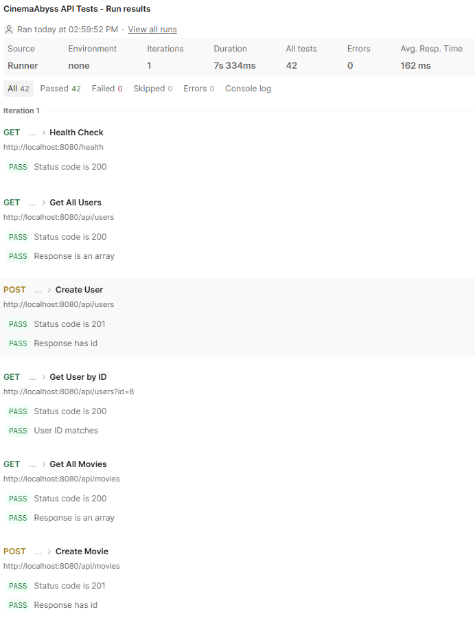
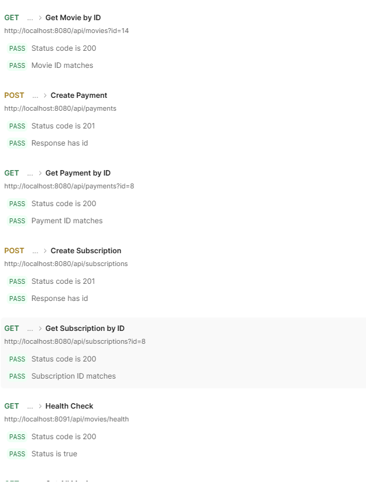
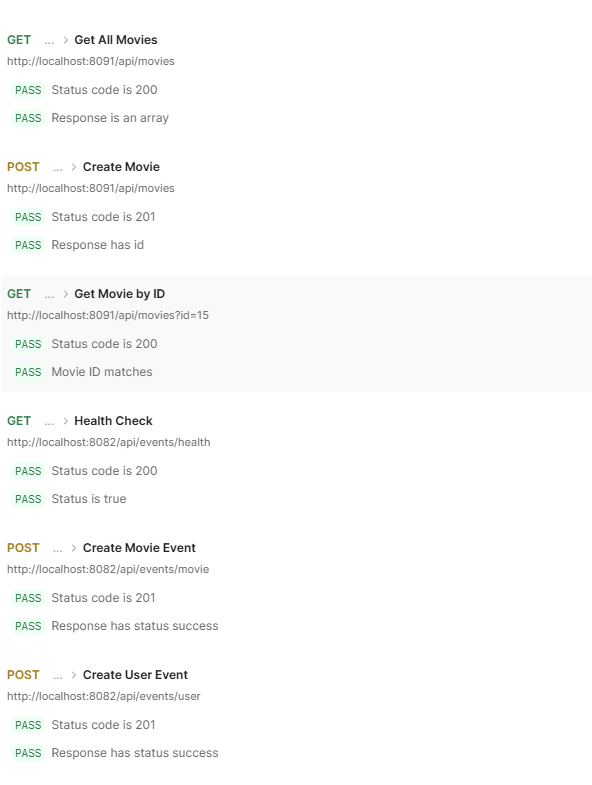
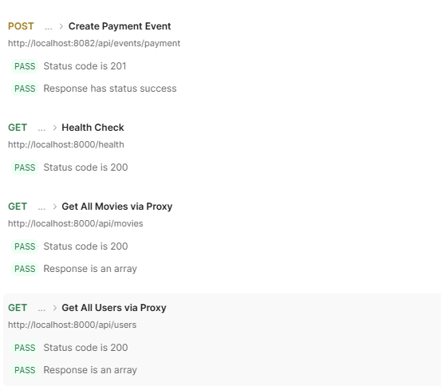

#### Состояния топиков Kafka из UI

# Задание 3

### CI/CD

Доработан деплой новых сервисов proxy и events в docker-build-push.yml , 
чтобы api-tests при сборке отрабатывали корректно при отправке 
коммита в ваш репозиторий.

#### Github workflows
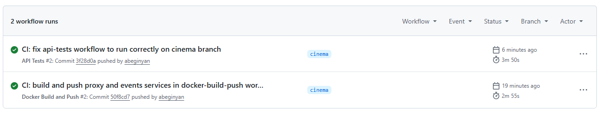

### Proxy в Kubernetes

#### Шаг 1

1. Создан Personal Access Token (PAT) с правом read:packages
2. В src/kubernetes/*.yaml отредактирован путь до образов (event-service, monolith, movies-service и proxy-service) 
3. Добавлен секрет src/kubernetes/dockerconfigsecret.yaml в поле из ~/.docker/config.json

#### Шаг 2

  Доработан src/kubernetes/event-service.yaml и src/kubernetes/proxy-service.yaml

  - Необходан Deployment и Service 
  - Доработан ingress.yaml, чтобы можно было с помощью тестов проверить создание событий
 
  - #### Кластер minikube
  
  Был установлен миникуб на локальную машину, поднят кластер и проверена работа ingress.
  
1. Создан namespace:
2. Создан секреты и переменные
3. Развернута база данных:

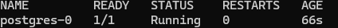

4. Развернута Kafka:
5. Развернут монолит:
6. Развернуты микросервисы:
7. Развернут прокси-сервис:

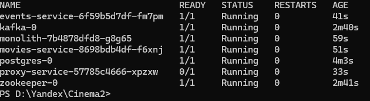

8. Добавлен ingress
9. Добавлен 127.0.0.1 cinemaabyss.example.com в /etc/hosts
10. Установлен minikube tunnel для проброса портов
11. Результат https://cinemaabyss.example.com/api/movies
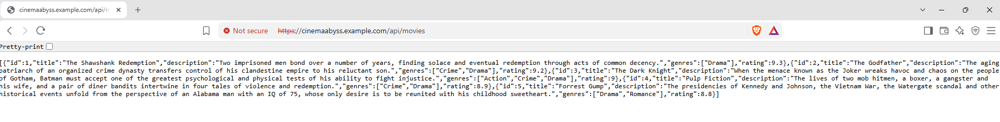
  
12. Запущены тесты из папки tests/postman
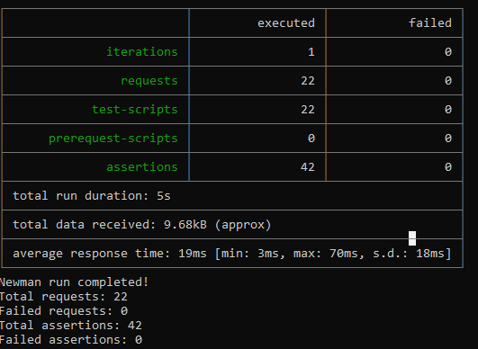
  
#### Шаг 3

Скриншот вывода при вызове https://cinemaabyss.example.com/api/movies

Cкриншот вывода event-service после вызова тестов.
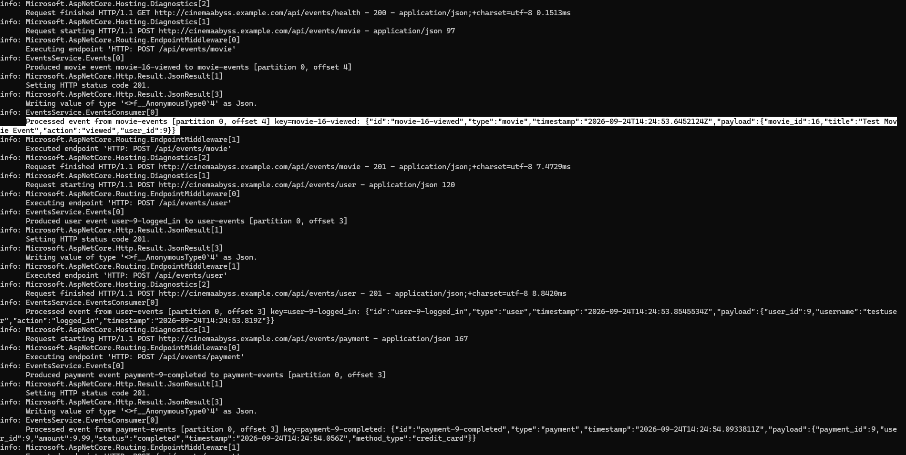

# Задание 4
Для простоты дальнейшего обновления и развертывания реализованы helm-чарты для прокси-сервиса

1. Отредактирован файл values.yaml

    - Записаны пути образов для всех сервисов
    - Скопировано значение из конфигурации kubernetes в imagePullSecret

2. ./templates/services 

    - Заполнены шаблоны для proxy-service.yaml и events-service.yaml (опирайтесь на свою kubernetes конфигурацию)

3. Проверка установки

- Сначала удаляем установку руками
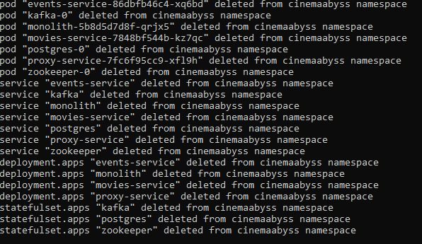

- Запускаем установку helm
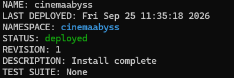

- Проверяем развертывание:
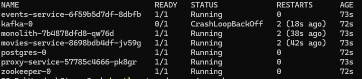

- Потом вызоваем https://cinemaabyss.example.com/api/movies
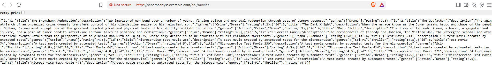